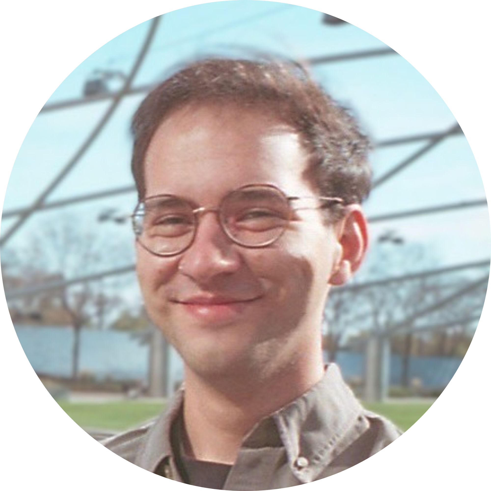

<!--  -->

# Arthur Borem

{: style="float: right" height="35%" width="35%"} Hi! I'm a final-year Computer Science PhD at UChicago. I've spent my time here mainly studying tools for data subject request compliance and building tech to support that process for consumers from around the world, but have also worked on other projects about online transparency and privacy ([check them out](#some-research-projects)!). For more on my background, see [my full bio](#bio).

I'm open to internships any time until the end of 2025 and open to full-time engineering and research roles starting Summer 2026!

Reach out via [arthurborem at uchicago.edu](mailto:arthurborem@uchicago.edu).

[Resume](assets/arthur_borem_resume.pdf), [Google Scholar](https://scholar.google.com/citations?hl=en&user=vuka1CgAAAAJ), [x.com/arthurborem](https://twitter.com/arthurborem), [LinkedIn](https://linkedin.com/in/arthurborem)

## Publications
### [Characterizing the Usability and Usefulness of U.S. Ad Transparency Systems](https://doi.ieeecomputersociety.org/10.1109/SP61157.2025.00148)
Kevin Bryson, **Arthur Borem**, Phoebe Moh, Omer Akgul, Laura Edelson, Tobias Lauinger, Michelle L. Mazurek, Damon McCoy, Blase Ur \
*IEEE S&P 2025*

### [Data Subjects' Reactions to Exercising Their Right of Access](https://www.usenix.org/system/files/usenixsecurity24-borem.pdf)
**Arthur Borem**, Elleen Pan, Olufunmilola Obielodan, Aurelie Roubinowitz, Luca Dovichi, Michelle L Mazurek, Blase Ur \
*USENIX Security Symposium 2024*

### [Evaluation of Ad Transparency Systems](https://conpro24.ieee-security.org/papers/bryson-conpro24.pdf)
Kevin Bryson, **Arthur Borem**, Phoebe Moh, Omer Akgul, Laura Edelson, Chriss Geeng, Tobias Lauinger, Michelle L. Mazurek, Damon McCoy, Blase Ur \
*IEEE ConPro 2024*

### [JupyterLab in Retrograde: Contextual Notifications That Highlight Fairness and Bias Issues for Data Scientists](https://dl.acm.org/doi/pdf/10.1145/3613904.3642755)
**Best Paper Award** \
Galen Harrison, Kevin Bryson, Ahmad Emmanuel Balla Bamba, Luca Dovichi, Aleksander Herrmann Binion, **Arthur Borem**, Blase Ur \
*ACM CHI 2024* 

### [Defining "Broken": User Experiences and Remediation Tactics When Ad-Blocking or Tracking-Protection Tools Break a Website’s User Experience](https://www.usenix.org/system/files/usenixsecurity23-nisenoff-broken.pdf)
Alexandra Nisenoff, **Arthur Borem**, Madison Pickering, Grant Nakanishi, Maya Thumpasery, Blase Ur \
*USENIX Security Symposium 2023*

### [Self-E: Smartphone-Supported Guidance for Customizable Self-Experimentation](https://jeffhuang.com/papers/SelfE_CHI21.pdf)
Nediyana Daskalova, Eindra Kyi, Kevin Ouyang, **Arthur Borem**, Sally Chen, Nicole Nugent, Jeff Huang \
*ACM CHI 2021*

### [Developing and Supporting STEM Undergraduate Teaching Assistants as Partners in Teaching](https://ieeexplore.ieee.org/document/9274088)
**Arthur Borem**, Christina Smith \
*IEEE Frontiers in Education (FIE) 2020*

## Talks
### [Designing a Data Subject Access Rights Tool](https://youtu.be/fytuWeb8IJc?si=XQUYh2vLxYHqvaP4)
**Arthur Borem** \
*USENIX PEPR 2024*

### [Data Subjects' Reactions to Exercising Their Right of Access](https://www.youtube.com/watch?v=RvqIAthC4xc)
**Arthur Borem** \
*USENIX Security Symposium 2024*

## (Some) Research Projects
### Visualizer for Data Subject Access Requests
I'm building a web tool for consumers who wish to explore and aggregate their personal data from making a Data Subject Access or Portability Request. It runs fully on the client-side and is platform agnostic.

### User study on enacting Data Subject Rights
After developing a data annotation web-app, I ran a user study with online consumers from around the world. They explored their data using the tool I built and noted things they found surprising or creepy. They were often overwhelmed and confused, but felt more trust toward the platforms the more transparency they were given. Watch [my talk](https://www.youtube.com/watch?v=RvqIAthC4xc) or read the [full paper](https://www.usenix.org/system/files/usenixsecurity24-borem.pdf) if you want to learn more!

### Ad transparency systems taxonomy and evaluation
Analyzed 22 online ad transparency platforms (e.g., [Google's My Ad Center](https://myadcenter.google.com)) and built a taxonomy listing every feature and affordance and which platforms implemented them. Then ran a user study where we asked around 200 participants to try to find specific settings and asked them about the process. Many of them were dissatisfied and found the existing systems overly complex, but also lacking key details. Read the [full paper](https://doi.ieeecomputersociety.org/10.1109/SP61157.2025.00148)!

### Fixing websites broken by ad-blockers and tracking protection browser extensions and tools
Built taxonomy for ways privacy extensions break websites by analyzing thousands of browser extension marketplace reviews for a dozen privacy extensions. After running a user study, identified the top ways users react when this happened to them. Based on this info, we are working on a solution that detects breakage by analyzing downstream effects of fetching and blocking specific resources. Read the [paper on the taxonomy](https://www.usenix.org/system/files/usenixsecurity23-nisenoff-broken.pdf) for more details!

## Bio
I was born and raised in Belo Horizonte (Brazil) and moved to the U.S. during my junior year of high school! I then went to **Brown University** where I graduated with a B.S. in Computer Science. While there, I was involved in research projects with [Seny Kamara](https://www.senykamara.com/) (applied cryptography), [Phil Klein](https://cs.brown.edu/people/pklein/) (fair census redistricting), and [Christina Smith](https://sheridan.brown.edu/people/christina-smith-phd) (pedagogy in higher education). I also did software engineering internships at [Bank of America Merrill Lynch](https://www.ml.com/wealthmanagement.html) and [Lyft](https://www.lyft.com/business).

After Brown, I was a full-stack software engineer at [Asana](https://asana.com/). There I revamped the [Do Not Disturb feature](https://help.asana.com/s/article/notification-settings?language=en_US#01HX9GY3F2M1X5C47ED8TKM2TG), launched [Messaging](https://help.asana.com/s/article/messages?language=en_US), maintained [email infrastructure](https://help.asana.com/s/article/use-asana-and-email?language=en_US), and built the transcription generation pipeline for [Video Messages](https://asana.com/inside-asana/vimeo-video-messaging), which [won us a Fast Company award](https://asana.com/press/releases/pr/asana-video-messaging-powered-by-vimeo-named-a-top-3-joint-venture-by-fast-company/6e2a25d1-2a6f-4fc1-a0eb-2f22c7d73ad5)!

Then I moved to Chicago to start my PhD!

## For Fun
In addition to working on online data privacy and data access/portability, I'm a huge fan of movies, learning languages (Spanish, Italian, and, most recently, Chinese!), crocheting, and going to concerts.
